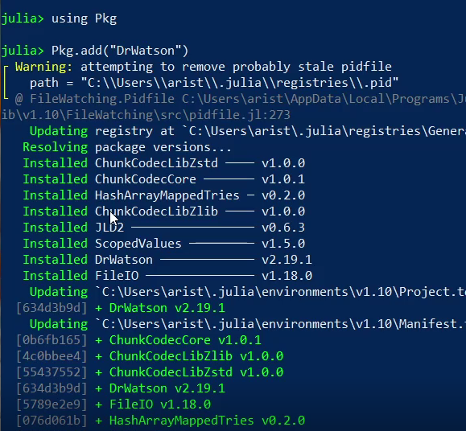
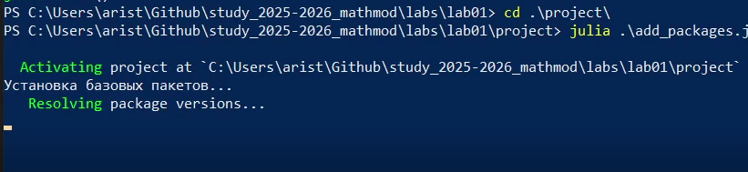
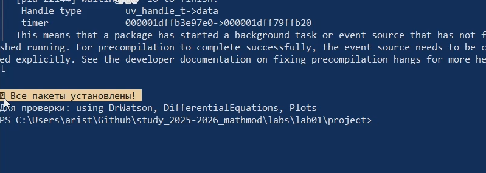
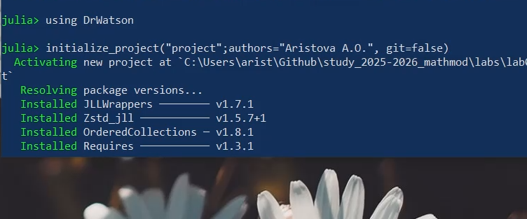
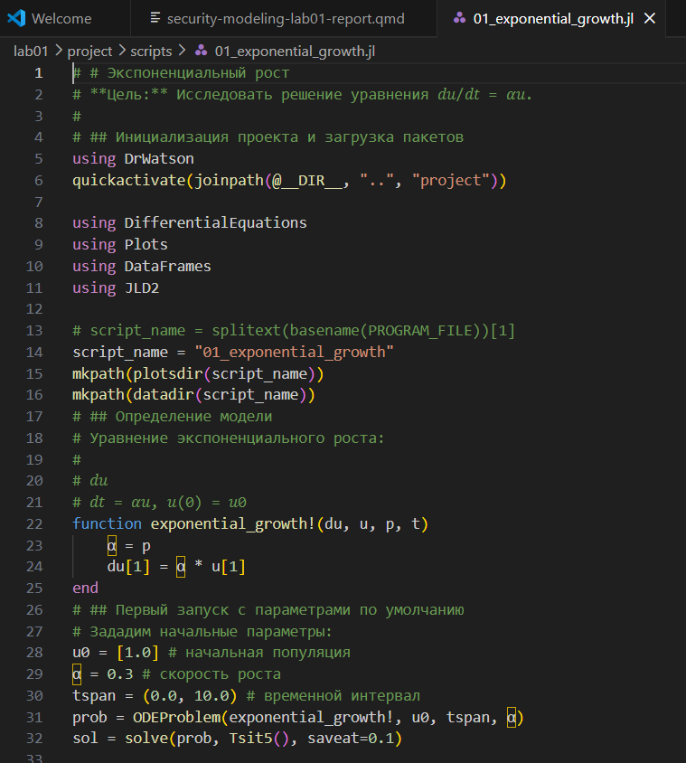
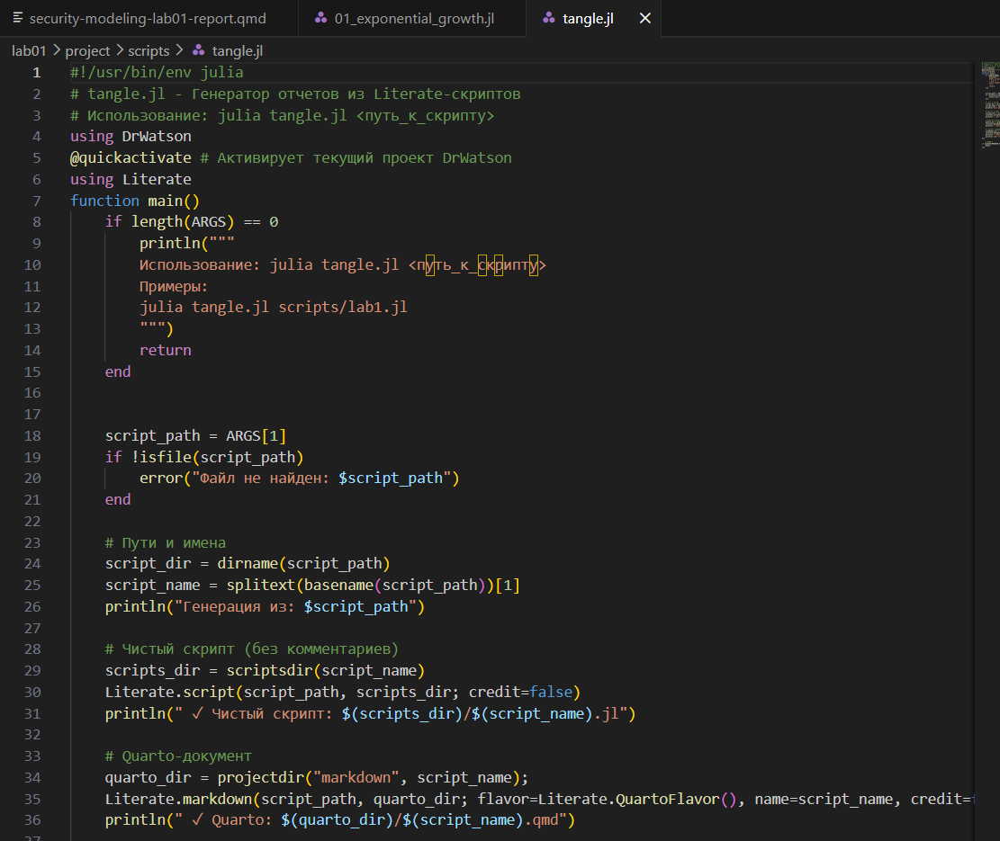
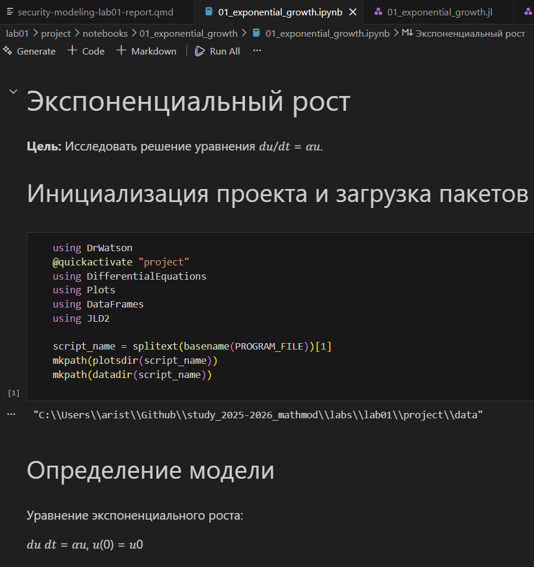
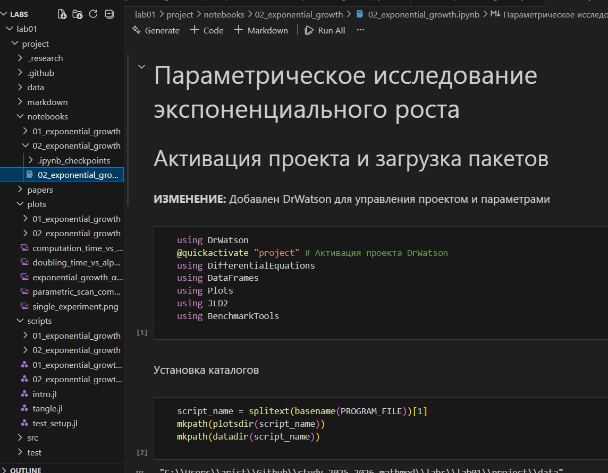

---
## Author
author:
  name: Аристова Арина Олеговна
  degrees: MSc
  email: 1032259382@rudn.ru
  affiliation:
    - name: Российский университет дружбы народов
      country: Российская Федерация
      postal-code: 117198
      city: Москва
      address: ул. Миклухо-Маклая, д. 6
## Title
title: "Лабораторная работа №1"
subtitle: "Основы литературного программирования"
license: CC BY
date: today
date-format: "YYYY-MM-DD"

format:
  beamer:
    lang: ru-RU
    colortheme: default                 
    mainfont: Arial
    monofont: Courier New
    aspectratio: 169
    incremental: false
    toc: false
    footer: false
    slide-number: true
    include-in-header: 
      text: |
        \setbeamertemplate{navigation symbols}{}
        \setbeamertemplate{headline}{}
        \setbeamertemplate{footline}{
          \hfill
          {\small \insertframenumber}
          \hspace{2em}
          \vspace{2em}
        }
        \setbeamertemplate{title page}[empty]
---

## Докладчик

:::::::::::::: {.columns align=center}
::: {.column width="70%"}

  * Аристова Арина Олеговна
  * студентка группы НФИмд-01-25
  * Российский университет дружбы народов
  * [1032259382@rudn.ru](mailto:1032259402@rudn.ru)
  * <https://github.com/aoaristova>

:::
::: {.column width="30%"}

:::
::::::::::::::

## Цель работы

Освоение методологии литературного программирования: создание самодокументируемого кода, его компиляция в исполняемые файлы (чистый код, Jupyter Notebook) и генерация технической документации (Quarto) с возможностью параметризации вычислений.

## Задачи

- Выполнить предложенный код и преобразовать код в литературный стиль.

- Сгенерировать из литературного кода:
  - чистый код;
  - jupyter notebook;
  - документацию в формате Quarto.

- Выполнить код из jupyter notebook.

- Интегрировать документацию в формате Quarto в отчёт.

- Добавить в код в литературном стиле вычисление для набора параметров.

## Подготовка проекта

{#fig-001 width=45%}

## Подготовка проекта

{#fig-002 width=70%}

## Подготовка проекта

{#fig-003 width=70%}

## Подготовка проекта

{#fig-004 width=70%}

## Подготовка проекта

{#fig-005 width=70%}

## Моделирование экспоненциального роста

{#fig-006 width=30%}

## Моделирование экспоненциального роста

{#fig-007 width=70%}

## Моделирование экспоненциального роста

{#fig-008 width=55%}

## Генерация производных форматов

{#fig-009 width=50%}

## Генерация производных форматов

{#fig-010 width=55%}

## Генерация производных форматов

{#fig-011 width=40%}

## Параметрическая версия модели

{#fig-013 width=40%}

## Параметрическая версия модели

{#fig-013 width=40%}

## Параметрическая версия модели

{#fig-014 width=65%}

## Параметрическая версия модели

{#fig-015 width=55%}

## Выводы

1. Создано рабочее пространство курса на основе пакета DrWatson с установленными зависимостями для математического моделирования.

2. Реализована модель экспоненциального роста в литературном стиле — код и документация совмещены в одном `.jl`-файле.

3. Из литературного кода автоматически сгенерированы три формата: чистый скрипт, Jupyter Notebook и документ Quarto.

4. Реализована параметризация расчётов — исследование модели при пяти различных значениях параметра α.

5. Итоговая документация объединяет код, результаты вычислений и аналитические выводы в едином воспроизводимом формате.

## Список литературы

1. A Multi-Language Computing Environment for Literate Programming and Reproducible Research / E. Schulte [et al.] // Journal of Statistical Software. — 2012. —
Vol. 46, no. 3. — ISSN 1548-7660. — DOI: 10.18637/jss.v046.i03.

2. Knuth D. E. Literate Programming // The Computer Journal. — 1984. — Feb. — Vol. 27, no. 2. — P. 97–111. — ISSN 1460-2067. — DOI: 10.1093/comjnl/27.2.97.

3. The Story in the Notebook / M. B. Kery [et al.] // Proceedings of the 2018 CHI Conference on Human Factors in Computing Systems. — ACM, 04/2018. — P. 1–11. — DOI:
10.1145/3173574.3173748.
