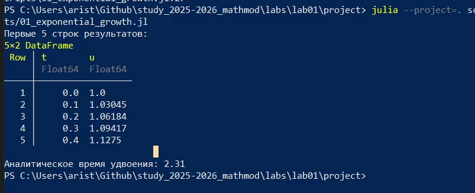
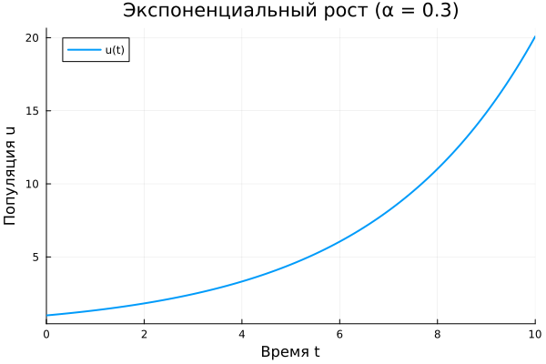
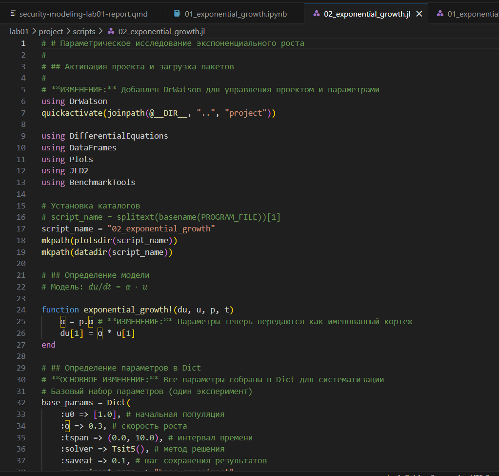
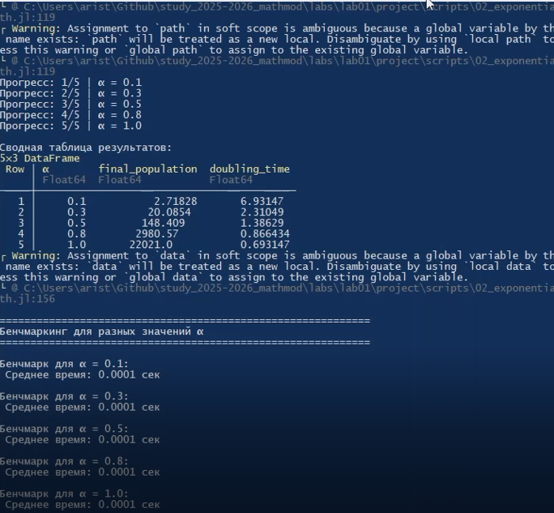

---
## Author
author:
  name: Аристова Арина Олеговна
  degrees: MSc
  email: 1032259402@rudn.ru
  affiliation:
    - name: Российский университет дружбы народов
      country: Российская Федерация
      postal-code: 117198
      city: Москва
      address: ул. Миклухо-Маклая, д. 6

## Title
title: "Лабораторная работа №1"
subtitle: "Основы литературного программирования"
license: "CC BY"
---

# Цель работы

Освоение методологии литературного программирования: создание самодокументируемого кода, его компиляция в исполняемые файлы (чистый код, Jupyter Notebook) и генерация технической документации (Quarto) с возможностью параметризации вычислений.

# Задание

- Создать рабочий каталог для всего курса.
- Создать рабочее пространство для программ в рамках лабораторной работы.
- Выполнить все задания по тексту лабораторной работы.
- Установить необходимые пакеты.
- Выполнить предложенный код.
- Преобразовать код в литературный стиль.
- Сгенерировать из литературного кода:
  - чистый код;
  - jupyter notebook;
  - документацию в формате Quarto.
- Выполнить код из jupyter notebook.
- Интегрировать документацию в формате Quarto в отчёт.
- Добавить в код в литературном стиле вычисление для набора параметров.
- Сгенерировать из литературного кода с параметрами:
  - чистый код;
  - jupyter notebook;
  - документацию в формате Quarto.
- Выполнить код из jupyter notebook с параметрами.
- Интегрировать документацию с параметрами в формате Quarto в отчёт.

# Теоретическое введение

Julia — высокоуровневый свободный язык программирования с динамической типизацией, созданный для математических вычислений. Эффективен также и для написания программ общего назначения. Синтаксис языка схож с синтаксисом других математических языков, однако имеет некоторые существенные отличия.

Экспоненциальный рост — это процесс увеличения величины, при котором скорость роста в каждый момент времени пропорциональна текущему значению этой величины. Чем больше система, тем быстрее она растет.

Дифференциальное уравнение модели:

$$\frac{du}{dt} = \alpha u$$

Решение уравнения:

$$u(t) = u_0 e^{\alpha t}$$

Экспоненциальный рост — идеализированная модель. В реальности он не может продолжаться бесконечно из-за ограниченности ресурсов. После некоторого времени рост обычно замедляется и переходит в логистический рост (S-образная кривая).

# Выполнение лабораторной работы

## Создание проекта DrWatson

Для выполнения работы необходимо создать проект с помощью пакета DrWatson ([рис. @fig-001], [рис. @fig-002]).

{#fig-001 width=70%}

{#fig-002 width=70%}

Итоговая структура проекта DrWatson ([рис. @fig-005]).

{#fig-005 width=70%}

## Базовая модель экспоненциального роста

Создан скрипт `scripts/01_exponential_growth.jl` в литературном стиле ([рис. @fig-006]).

{#fig-006 width=70%}

Скрипт выполнен, получены результаты: таблица значений и аналитическое время удвоения ([рис. @fig-007]).

{#fig-007 width=70%}

Получен график экспоненциального роста ([рис. @fig-008]).

{#fig-008 width=70%}

## Генерация производных форматов

Создан скрипт `scripts/tangle.jl` для генерации производных форматов ([рис. @fig-009]).

{#fig-009 width=70%}

В результате получены файлы в форматах `.qmd` и `.ipynb` ([рис. @fig-010], [рис. @fig-011]).

{#fig-010 width=70%}

{#fig-011 width=70%}

## Параметрическая версия модели

Создан скрипт `scripts/02_exponential_growth.jl`, реализующий параметрическое исследование модели для набора значений параметра $\alpha$ ([рис. @fig-012]).

{#fig-012 width=70%}

Скрипт выполнен, получена сводная таблица результатов для всех значений $\alpha$ ([рис. @fig-013]).

{#fig-013 width=70%}

Получены сравнительные графики для различных значений $\alpha$ ([рис. @fig-014]).

{#fig-014 width=70%}

Параметрическая версия выполнена в Jupyter Notebook ([рис. @fig-015]).

{#fig-015 width=70%}





# Выводы

1. Создано рабочее пространство курса на основе пакета DrWatson с установленными зависимостями для мат. моделировани.
2. Реализована модель экспоненциального роста в литературном стиле - код и документация совмещены в одном ".jl"-файле.
3. Из литетурного кода автоматически сгенерированы три формата: чистый скрипт, Jupyter Notebook, документа Quarty.
4. Реализация параметрических расчетов - проведено исследование модели при пяти разный значниях праметра $\alpha$.
5. Итоговая документация объединяет код, результат вычисления и аналитические выводы в одном едином воспроизводимом формате.

# Список литературы{.unnumbered}

::: {#refs}
:::

1. A Multi-Language Computing Environment for Literate Programming and Reproducible Research / E. Schulte [et al.] // Journal of Statistical Software. — 2012. —
Vol. 46, no. 3. — ISSN 1548-7660. — DOI: 10.18637/jss.v046.i03.

2. Knuth D. E. Literate Programming // The Computer Journal. — 1984. — Feb. — Vol. 27, no. 2. — P. 97–111. — ISSN 1460-2067. — DOI: 10.1093/comjnl/27.2.97.

3. The Story in the Notebook / M. B. Kery [et al.] // Proceedings of the 2018 CHI Conference on Human Factors in Computing Systems. — ACM, 04/2018. — P. 1–11. — DOI:
10.1145/3173574.3173748.
